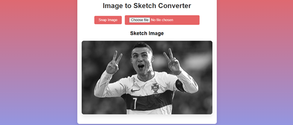
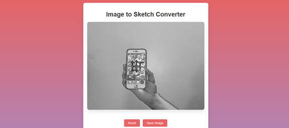
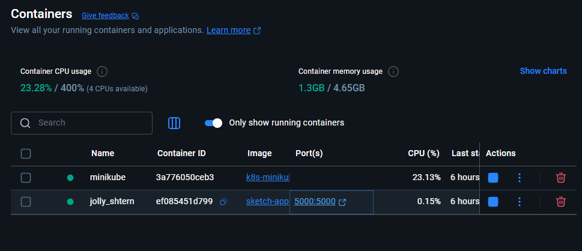
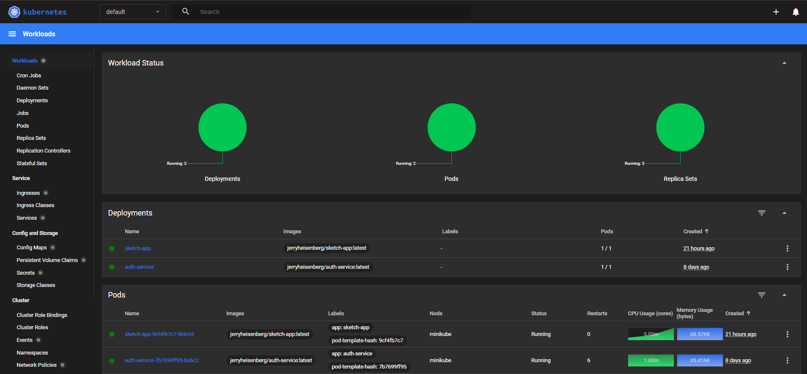

# 🛠️ Image to Sketch - DevOps Capstone (Flask + OpenCV + CI/CD + Kubernetes)

Convert webcam or uploaded images into pencil sketch art in real-time with a Flask-based application — containerized, CI/CD enabled, and deployed on a Minikube cluster.

---

## 🚀 Project Overview

This project demonstrates the full DevOps lifecycle using:

- ✅ Flask App with OpenCV
- ✅ Dockerized Container
- ✅ GitHub Actions CI/CD Pipeline
- ✅ Kubernetes (Minikube) Deployment
- ✅ Image Pull from Docker Hub
- ✅ Responsive Web UI

---

## 🖼️ Features

- 🎥 Live webcam-to-sketch converter
- 📁 Upload image and convert to sketch
- 💾 Save and download sketch
- 💡 Modern HTML/CSS interface
- ⚙️ Automated build, test, push, and deploy using GitHub Actions + K8s

---

## 📦 Technologies Used

| Tool           | Purpose                                      |
|----------------|----------------------------------------------|
| **Flask**      | web application                              |
| **OpenCV**     | Real-time image processing                   |
| **Docker**     | Containerization                             |
| **GitHub Actions** | CI/CD pipeline automation                |
| **Minikube**   | Local Kubernetes Cluster                     |
| **kubectl**    | K8s CLI for deploying and managing resources |
| **Docker Hub** | Container registry                           |

---

## 🐳 Docker Image

Available on Docker Hub:

```
docker pull jerryheisenberg/sketch-app:latest
docker run -p 5000:5000 jerryheisenberg/sketch-app
```

## 🔁 CI/CD Workflow

📁 1. CI/CD GitHub Actions

Workflow Trigger:
Push to main branch triggers:
```
Build and Push Docker Image
```
Deploy to Minikube via Self-Hosted Runner

## 🔄 Flow Diagram
```
┌──────────────┐       ┌─────────────────────┐
│  Git Commit  ├──────▶│ GitHub Actions CI   │
└──────────────┘       └──────┬──────────────┘
                              ▼
                   🐳 Docker Build & Push
                              ▼
                  📦 Push to Docker Hub
                              ▼
            ⚙️ Deploy via Minikube & kubectl
```

## ⚙️ Kubernetes Deployment

YAML Files:
deployment.yaml: Defines pods & image to run

service.yaml: Exposes deployment as NodePort service

Minikube Deployment Steps:
```
# Point Docker to Minikube
eval $(minikube docker-env)

# Pull image (optional if image is from Docker Hub)
docker pull jerryheisenberg/sketch-app:latest

# Apply K8s configurations
kubectl apply -f deployment.yaml
kubectl apply -f service.yaml

# Check deployment status
kubectl rollout status deployment/sketch-app

# Access the app
minikube service sketch-app-service --url

```
## 🔧 How to Run Locally (Without Docker)
```
git clone https://github.com/YOUR_USERNAME/image-to-sketch.git
cd image-to-sketch
pip install -r requirements.txt
python app.py
```
## 📷 Deployment Screenshot
App Screenshot:




Docker running snap: 



Minikube Dashboard:




## ✅ DevOps Checklist

 Dockerized Flask application

 CI/CD pipeline using GitHub Actions

 Docker image pushed to Docker Hub

 Kubernetes manifests (deployment + service)

 Self-hosted GitHub runner for Minikube

 Project running on Minikube cluster

 Clean, responsive UI

 Documented in README

## 🔗 Links
🔗 Docker Hub: jerryheisenberg/sketch-app

📁 GitHub Repo: https://github.com/jerryHeisenberg/Sketch-app-devops

